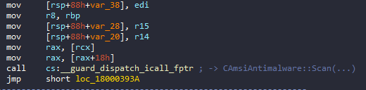
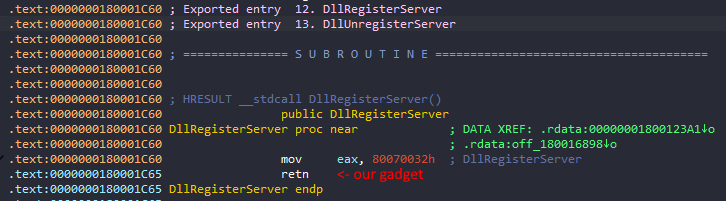

# amsi_bypass
currently undetected by windows defender

a bypass that does not patch any executable sections since that is very easy to detect.\
this script overwrites the pointer to "CAmsiAntimalware::Scan" inside the amsi context (.data)\
to keep it simple: it's basically vtable pointer swapping\

